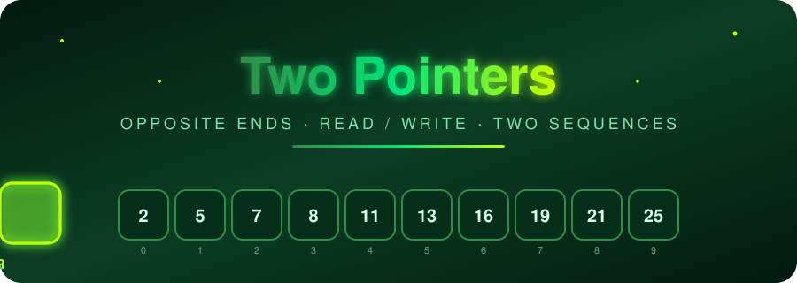
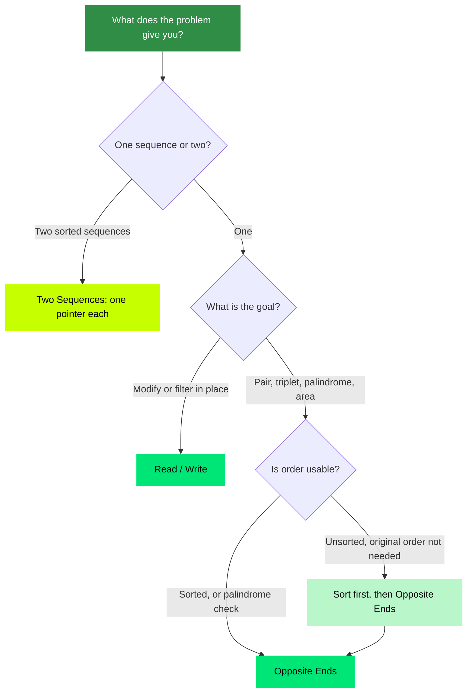
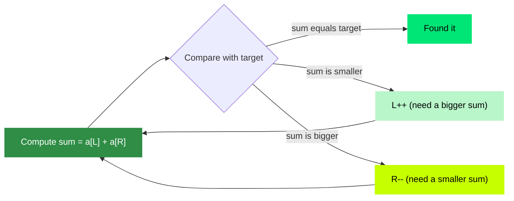
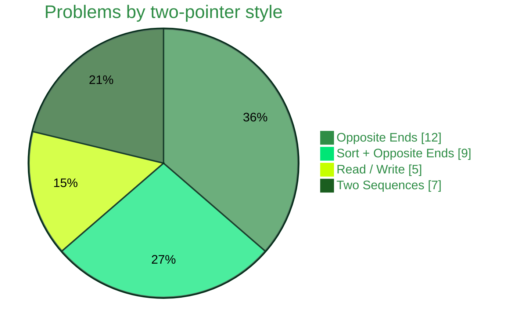

<div align="center">



<br/>


[+%E2%86%92+O(n).)](https://git.io/typing-svg)

**[📖 Striver A2Z DSA Sheet](https://takeuforward.org/prep-hub/strivers-a2z-dsa-sheet)**

</div>

> [!NOTE]
> Only problems solved with a pure two-pointer approach are included. No sliding window, no fast/slow linked-list problems, no binary search or other patterns. A "—" means no link is added for that platform (no exact match, or the link is not verified). The small text under each problem name shows which two-pointer style it uses.


## 🎬 See Each Style In Action

<div align="center">



<br/><br/>



<br/><br/>



</div>

<br/>

**Sort + Opposite Ends** is the first animation with one extra step in front: sort the array, then walk inward exactly like *Two Sum II*. Sorting costs `O(n log n)` but removes the inner loop, so `3 Sum` drops from `O(n³)` to `O(n²)`.

---

## 🧭 The Four Two-Pointer Styles

| Style | Use it when | Core idea |
| :-- | :-- | :-- |
| 🔀 **Opposite Ends** | Sorted arrays, pairs, palindromes | `left = 0`, `right = n-1`; move inward based on the sum or comparison |
| 🧮 **Sort + Opposite Ends** | Pair/triplet sums on unsorted input | Sort first, then use Opposite Ends to cut the inner loop |
| ✍️ **Read / Write** | In-place filtering or compaction | `read` scans every element, `write` marks where the next valid one goes |
| 🧬 **Two Sequences** | Merging or comparing two arrays/strings | One pointer per sequence, advance the smaller or matching one |

### 🗺️ Which Style Do I Need?



### ⚖️ The Move Rule (Opposite Ends)



### 🥧 What's In This List




<div align="center">

## 🟢 Two Pointers — Easy

<table>
<thead>
<tr>
<th align="center">#</th>
<th align="left">Problem</th>
<th align="center">Level</th>
<th align="center">GFG</th>
<th align="center">LeetCode</th>
<th align="center">TUF</th>
</tr>
</thead>
<tbody>
<tr>
<td align="center">1</td>
<td><b>Valid Palindrome</b><br/><sub>Opposite Ends</sub></td>
<td align="center">🟢&nbsp;Easy</td>
<td align="center"><a href="https://www.geeksforgeeks.org/problems/palindrome-string0817/1"></a></td>
<td align="center"><a href="https://leetcode.com/problems/valid-palindrome/"></a></td>
<td align="center">—</td>
</tr>
<tr>
<td align="center">2</td>
<td><b>Reverse String</b><br/><sub>Opposite Ends</sub></td>
<td align="center">🟢&nbsp;Easy</td>
<td align="center">—</td>
<td align="center"><a href="https://leetcode.com/problems/reverse-string/"></a></td>
<td align="center">—</td>
</tr>
<tr>
<td align="center">3</td>
<td><b>Valid Palindrome II</b><br/><sub>Opposite Ends</sub></td>
<td align="center">🟢&nbsp;Easy</td>
<td align="center">—</td>
<td align="center"><a href="https://leetcode.com/problems/valid-palindrome-ii/"></a></td>
<td align="center">—</td>
</tr>
<tr>
<td align="center">4</td>
<td><b>Reverse Vowels of a String</b><br/><sub>Opposite Ends</sub></td>
<td align="center">🟢&nbsp;Easy</td>
<td align="center">—</td>
<td align="center"><a href="https://leetcode.com/problems/reverse-vowels-of-a-string/"></a></td>
<td align="center">—</td>
</tr>
<tr>
<td align="center">5</td>
<td><b>Squares of a Sorted Array</b><br/><sub>Opposite Ends</sub></td>
<td align="center">🟢&nbsp;Easy</td>
<td align="center">—</td>
<td align="center"><a href="https://leetcode.com/problems/squares-of-a-sorted-array/"></a></td>
<td align="center">—</td>
</tr>
<tr>
<td align="center">6</td>
<td><b>Move Zeros to End</b><br/><sub>Read / Write</sub></td>
<td align="center">🟢&nbsp;Easy</td>
<td align="center"><a href="https://www.geeksforgeeks.org/problems/move-all-zeroes-to-end-of-array0751/1/"></a></td>
<td align="center"><a href="https://leetcode.com/problems/move-zeroes/"></a></td>
<td align="center"><a href="https://takeuforward.org/practice/dsa/move-zeros-to-end"></a></td>
</tr>
<tr>
<td align="center">7</td>
<td><b>Remove Duplicates from Sorted Array</b><br/><sub>Read / Write</sub></td>
<td align="center">🟢&nbsp;Easy</td>
<td align="center"><a href="https://www.geeksforgeeks.org/problems/remove-duplicates-in-place-from-sorted-array/1/"></a></td>
<td align="center"><a href="https://leetcode.com/problems/remove-duplicates-from-sorted-array/"></a></td>
<td align="center"><a href="https://takeuforward.org/practice/dsa/remove-duplicates-from-sorted-array"></a></td>
</tr>
<tr>
<td align="center">8</td>
<td><b>Remove Element</b><br/><sub>Read / Write</sub></td>
<td align="center">🟢&nbsp;Easy</td>
<td align="center">—</td>
<td align="center"><a href="https://leetcode.com/problems/remove-element/"></a></td>
<td align="center">—</td>
</tr>
<tr>
<td align="center">9</td>
<td><b>Sort Array By Parity</b><br/><sub>Opposite Ends</sub></td>
<td align="center">🟢&nbsp;Easy</td>
<td align="center">—</td>
<td align="center"><a href="https://leetcode.com/problems/sort-array-by-parity/"></a></td>
<td align="center">—</td>
</tr>
<tr>
<td align="center">10</td>
<td><b>Merge Sorted Array</b><br/><sub>Two Sequences</sub></td>
<td align="center">🟢&nbsp;Easy</td>
<td align="center">—</td>
<td align="center"><a href="https://leetcode.com/problems/merge-sorted-array/"></a></td>
<td align="center">—</td>
</tr>
<tr>
<td align="center">11</td>
<td><b>Find the Union of Two Sorted Arrays</b><br/><sub>Two Sequences</sub></td>
<td align="center">🟢&nbsp;Easy</td>
<td align="center"><a href="https://www.geeksforgeeks.org/problems/union-of-two-sorted-arrays-1587115621/1/"></a></td>
<td align="center">—</td>
<td align="center"><a href="https://takeuforward.org/practice/dsa/find-the-union"></a></td>
</tr>
<tr>
<td align="center">12</td>
<td><b>Is Subsequence</b><br/><sub>Two Sequences</sub></td>
<td align="center">🟢&nbsp;Easy</td>
<td align="center">—</td>
<td align="center"><a href="https://leetcode.com/problems/is-subsequence/"></a></td>
<td align="center">—</td>
</tr>
<tr>
<td align="center">13</td>
<td><b>Backspace String Compare</b><br/><sub>Two Sequences</sub></td>
<td align="center">🟢&nbsp;Easy</td>
<td align="center">—</td>
<td align="center"><a href="https://leetcode.com/problems/backspace-string-compare/"></a></td>
<td align="center">—</td>
</tr>
<tr>
<td align="center">14</td>
<td><b>Count Pairs Whose Sum Is Less Than Target</b><br/><sub>Sort + Opposite Ends</sub></td>
<td align="center">🟢&nbsp;Easy</td>
<td align="center">—</td>
<td align="center"><a href="https://leetcode.com/problems/count-pairs-whose-sum-is-less-than-target/"></a></td>
<td align="center">—</td>
</tr>
</tbody>
</table>

---

## 🟡 Two Pointers — Medium

<table>
<thead>
<tr>
<th align="center">#</th>
<th align="left">Problem</th>
<th align="center">Level</th>
<th align="center">GFG</th>
<th align="center">LeetCode</th>
<th align="center">TUF</th>
</tr>
</thead>
<tbody>
<tr>
<td align="center">15</td>
<td><b>Two Sum II — Input Array Is Sorted</b><br/><sub>Opposite Ends</sub></td>
<td align="center">🟡&nbsp;Medium</td>
<td align="center">—</td>
<td align="center"><a href="https://leetcode.com/problems/two-sum-ii-input-array-is-sorted/"></a></td>
<td align="center">—</td>
</tr>
<tr>
<td align="center">16</td>
<td><b>Container With Most Water</b><br/><sub>Opposite Ends</sub></td>
<td align="center">🟡&nbsp;Medium</td>
<td align="center"><a href="https://www.geeksforgeeks.org/problems/container-with-most-water0535/1"></a></td>
<td align="center"><a href="https://leetcode.com/problems/container-with-most-water/"></a></td>
<td align="center">—</td>
</tr>
<tr>
<td align="center">17</td>
<td><b>3 Sum</b><br/><sub>Sort + Opposite Ends</sub></td>
<td align="center">🟡&nbsp;Medium</td>
<td align="center"><a href="https://www.geeksforgeeks.org/problems/find-triplets-with-zero-sum/1/"></a></td>
<td align="center"><a href="https://leetcode.com/problems/3sum/"></a></td>
<td align="center"><a href="https://takeuforward.org/practice/dsa/3-sum"></a></td>
</tr>
<tr>
<td align="center">18</td>
<td><b>3 Sum Closest</b><br/><sub>Sort + Opposite Ends</sub></td>
<td align="center">🟡&nbsp;Medium</td>
<td align="center">—</td>
<td align="center"><a href="https://leetcode.com/problems/3sum-closest/"></a></td>
<td align="center">—</td>
</tr>
<tr>
<td align="center">19</td>
<td><b>4 Sum</b><br/><sub>Sort + Opposite Ends</sub></td>
<td align="center">🟡&nbsp;Medium</td>
<td align="center"><a href="https://www.geeksforgeeks.org/problems/find-all-four-sum-numbers1732/1/"></a></td>
<td align="center"><a href="https://leetcode.com/problems/4sum/"></a></td>
<td align="center"><a href="https://takeuforward.org/practice/dsa/4-sum"></a></td>
</tr>
<tr>
<td align="center">20</td>
<td><b>Max Number of K-Sum Pairs</b><br/><sub>Sort + Opposite Ends</sub></td>
<td align="center">🟡&nbsp;Medium</td>
<td align="center">—</td>
<td align="center"><a href="https://leetcode.com/problems/max-number-of-k-sum-pairs/"></a></td>
<td align="center">—</td>
</tr>
<tr>
<td align="center">21</td>
<td><b>Boats to Save People</b><br/><sub>Sort + Opposite Ends</sub></td>
<td align="center">🟡&nbsp;Medium</td>
<td align="center">—</td>
<td align="center"><a href="https://leetcode.com/problems/boats-to-save-people/"></a></td>
<td align="center">—</td>
</tr>
<tr>
<td align="center">22</td>
<td><b>Valid Triangle Number</b><br/><sub>Sort + Opposite Ends</sub></td>
<td align="center">🟡&nbsp;Medium</td>
<td align="center">—</td>
<td align="center"><a href="https://leetcode.com/problems/valid-triangle-number/"></a></td>
<td align="center">—</td>
</tr>
<tr>
<td align="center">23</td>
<td><b>Sum of Square Numbers</b><br/><sub>Opposite Ends</sub></td>
<td align="center">🟡&nbsp;Medium</td>
<td align="center">—</td>
<td align="center"><a href="https://leetcode.com/problems/sum-of-square-numbers/"></a></td>
<td align="center">—</td>
</tr>
<tr>
<td align="center">24</td>
<td><b>Bag of Tokens</b><br/><sub>Sort + Opposite Ends</sub></td>
<td align="center">🟡&nbsp;Medium</td>
<td align="center">—</td>
<td align="center"><a href="https://leetcode.com/problems/bag-of-tokens/"></a></td>
<td align="center">—</td>
</tr>
<tr>
<td align="center">25</td>
<td><b>Remove Duplicates from Sorted Array II</b><br/><sub>Read / Write</sub></td>
<td align="center">🟡&nbsp;Medium</td>
<td align="center">—</td>
<td align="center"><a href="https://leetcode.com/problems/remove-duplicates-from-sorted-array-ii/"></a></td>
<td align="center">—</td>
</tr>
<tr>
<td align="center">26</td>
<td><b>Rearrange Array Elements by Sign</b><br/><sub>Read / Write</sub></td>
<td align="center">🟡&nbsp;Medium</td>
<td align="center"><a href="https://www.geeksforgeeks.org/problems/array-of-alternate-ve-and-ve-nos1401/1/"></a></td>
<td align="center"><a href="https://leetcode.com/problems/rearrange-array-elements-by-sign/"></a></td>
<td align="center"><a href="https://takeuforward.org/practice/dsa/rearrange-array-elements-by-sign"></a></td>
</tr>
<tr>
<td align="center">27</td>
<td><b>Interval List Intersections</b><br/><sub>Two Sequences</sub></td>
<td align="center">🟡&nbsp;Medium</td>
<td align="center">—</td>
<td align="center"><a href="https://leetcode.com/problems/interval-list-intersections/"></a></td>
<td align="center">—</td>
</tr>
<tr>
<td align="center">28</td>
<td><b>Number of Subsequences That Satisfy the Given Sum Condition</b><br/><sub>Sort + Opposite Ends</sub></td>
<td align="center">🟡&nbsp;Medium</td>
<td align="center">—</td>
<td align="center"><a href="https://leetcode.com/problems/number-of-subsequences-that-satisfy-the-given-sum-condition/"></a></td>
<td align="center">—</td>
</tr>
</tbody>
</table>

---

## 🔴 Two Pointers — Hard

<table>
<thead>
<tr>
<th align="center">#</th>
<th align="left">Problem</th>
<th align="center">Level</th>
<th align="center">GFG</th>
<th align="center">LeetCode</th>
<th align="center">TUF</th>
</tr>
</thead>
<tbody>
<tr>
<td align="center">29</td>
<td><b>Trapping Rain Water</b><br/><sub>Opposite Ends</sub></td>
<td align="center">🔴&nbsp;Hard</td>
<td align="center"><a href="https://www.geeksforgeeks.org/problems/trapping-rain-water-1587115621/1/"></a></td>
<td align="center"><a href="https://leetcode.com/problems/trapping-rain-water/"></a></td>
<td align="center">—</td>
</tr>
<tr>
<td align="center">30</td>
<td><b>Merge Two Sorted Arrays Without Extra Space</b><br/><sub>Two Sequences</sub></td>
<td align="center">🔴&nbsp;Hard</td>
<td align="center"><a href="https://www.geeksforgeeks.org/problems/merge-two-sorted-arrays-1587115620/1/"></a></td>
<td align="center"><a href="https://leetcode.com/problems/merge-sorted-array/"></a></td>
<td align="center"><a href="https://takeuforward.org/practice/dsa/merge-two-sorted-arrays-without-extra-space"></a></td>
</tr>
<tr>
<td align="center">31</td>
<td><b>Get the Maximum Score</b><br/><sub>Two Sequences</sub></td>
<td align="center">🔴&nbsp;Hard</td>
<td align="center">—</td>
<td align="center"><a href="https://leetcode.com/problems/get-the-maximum-score/"></a></td>
<td align="center">—</td>
</tr>
<tr>
<td align="center">32</td>
<td><b>Minimum Number of Moves to Make Palindrome</b><br/><sub>Opposite Ends</sub></td>
<td align="center">🔴&nbsp;Hard</td>
<td align="center">—</td>
<td align="center"><a href="https://leetcode.com/problems/minimum-number-of-moves-to-make-palindrome/"></a></td>
<td align="center">—</td>
</tr>
<tr>
<td align="center">33</td>
<td><b>Longest Chunked Palindrome Decomposition</b><br/><sub>Opposite Ends</sub></td>
<td align="center">🔴&nbsp;Hard</td>
<td align="center">—</td>
<td align="center"><a href="https://leetcode.com/problems/longest-chunked-palindrome-decomposition/"></a></td>
<td align="center">—</td>
</tr>
</tbody>
</table>

</div>

---

## 🔥 Templates

<details open>
<summary><b>🔀 Opposite Ends</b></summary>

```java
int left = 0, right = n - 1;

while (left < right) {
    int sum = arr[left] + arr[right];

    if (sum == target)      { /* found */ left++; right--; }
    else if (sum < target)  left++;      // need a bigger sum
    else                    right--;     // need a smaller sum
}
```

</details>

<details>
<summary><b>🧮 Sort + Opposite Ends (3 Sum, with duplicate skipping)</b></summary>

```java
Arrays.sort(nums);
List<List<Integer>> res = new ArrayList<>();

for (int i = 0; i < n - 2; i++) {
    if (i > 0 && nums[i] == nums[i - 1]) continue;       // skip duplicate anchors
    int l = i + 1, r = n - 1;
    while (l < r) {
        int s = nums[i] + nums[l] + nums[r];
        if (s == 0) {
            res.add(List.of(nums[i], nums[l], nums[r]));
            while (l < r && nums[l] == nums[l + 1]) l++;  // skip duplicates
            while (l < r && nums[r] == nums[r - 1]) r--;
            l++; r--;
        } else if (s < 0) l++;
        else r--;
    }
}
```

</details>

<details>
<summary><b>✍️ Read / Write</b></summary>

```java
int write = 0;

for (int read = 0; read < n; read++) {
    if (isValid(arr[read])) {          // keep this element
        arr[write++] = arr[read];
    }
}
// arr[0 .. write-1] is the filtered result
```

</details>

<details>
<summary><b>🧬 Two Sequences (merge)</b></summary>

```java
int i = 0, j = 0, k = 0;

while (i < a.length && j < b.length) {
    out[k++] = (a[i] <= b[j]) ? a[i++] : b[j++];
}
while (i < a.length) out[k++] = a[i++];
while (j < b.length) out[k++] = b[j++];
```

</details>

---

## 🧩 Quick Pattern Recognition

| Question wording | Think |
| :-- | :-- |
| **Sorted array + pair with sum / difference** | Opposite Ends |
| **Is it a palindrome? / reverse in place** | Opposite Ends |
| **Maximize area / minimize something between two ends** | Opposite Ends (move the weaker side) |
| **Unsorted + find pairs / triplets / quadruplets** | Sort + Opposite Ends |
| **Remove / move / compact in place** | Read / Write |
| **Merge, intersect, or compare two sorted inputs** | Two Sequences |
| **Is A a subsequence of B?** | Two Sequences |

## 🧠 Memory Trick

<div align="center">

| 🔀 **ENDS** | ✍️ **READ / WRITE** | 🧬 **TWO LISTS** | 🧮 **SORT FIRST** |
| :--: | :--: | :--: | :--: |
| squeeze inward | scan + place | advance the smaller | then squeeze |

</div>


## 🧠 Recommended Practice Flow

1. Read the problem only.
2. Write the brute-force (usually nested loops, `O(n²)`) first.
3. Ask: *can sorting, or a second pointer, remove the inner loop?*
4. Pick the style from the table above.
5. Write the optimal solution yourself in VS Code.
6. Dry-run one normal example and one edge case (empty, single element, duplicates).
7. Only then check the editorial/video if needed.

### ✅ Quick Revision Checklist

- [ ] Two Pointers Easy — 14
- [ ] Two Pointers Medium — 14
- [ ] Two Pointers Hard — 5
- [ ] Total — 33

### 🔗 Related Resources

- [Striver A2Z DSA Sheet](https://takeuforward.org/prep-hub/strivers-a2z-dsa-sheet)
- [Take U Forward](https://takeuforward.org/)
- [LeetCode](https://leetcode.com/)
- [GeeksforGeeks](https://www.geeksforgeeks.org/)

> [!IMPORTANT]
> Hard problems that rely only on two pointers are rare, so the Hard list is shorter than Easy and Medium. Difficulty follows LeetCode, except the Striver-style "Merge Two Sorted Arrays Without Extra Space", which Striver rates as Hard.

<div align="center">

</div>