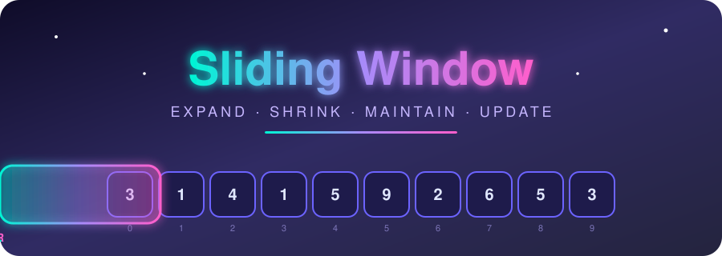
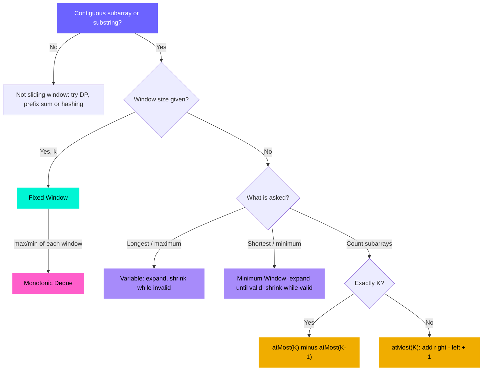

<div align="center">



<br/>


[+%E2%86%92+O(n)+in+one+idea.;contiguous+%2B+condition+%3D+sliding+window.)](https://git.io/typing-svg)

**[📖 Striver A2Z DSA Sheet](https://takeuforward.org/prep-hub/strivers-a2z-dsa-sheet)**

</div>

> [!NOTE]
> Only problems where **Sliding Window is a core part of the intended approach** are included.
>
> The **Company** column shows companies associated with the problem through interview / company-tag sources. If none could be verified, `—` is used. A `—` in a platform column means no link is added (no exact match, or the link is not verified).


## 🎬 See It In Action

<div align="center">



<br/><br/>



</div>

<br/>

**Fixed** windows slide in lockstep: one element enters, one leaves, and you update the running value in `O(1)`. **Variable** windows breathe: `right` stretches until the condition breaks, then `left` pulls in until it is valid again. Every element enters once and leaves once, so the whole pass is `O(n)`.

---

## 🧭 The Sliding Window Patterns

| Pattern | Use it when | Core idea |
| :-- | :-- | :-- |
| **Fixed Window** | Window size `k` is fixed | Add the new element, remove the one leaving the window |
| **Variable Window** | Window size depends on a condition | Expand with `right`, shrink with `left` |
| **Frequency Window** | Characters/elements inside the window must be counted | Maintain a frequency map/array |
| **At Most K** | Window can hold at most `k` violations/distinct elements | Shrink while the condition is violated |
| **Exactly K** | Need exactly `k` distinct elements/items | Often `atMost(k) - atMost(k - 1)` |
| **Minimum Window** | Need the smallest valid substring/subarray | Expand until valid, then shrink as far as possible |
| **Deque Window** | Need max/min for every window | Maintain a monotonic deque |

### 🗺️ Which Window Do I Need?




<div align="center">

## 🟢 Sliding Window — Easy

<table>
<thead>
<tr>
<th align="center">#</th>
<th align="left">Problem</th>
<th align="center">Level</th>
<th align="center">Pattern</th>
<th align="center">Company</th>
<th align="center">GFG</th>
<th align="center">LeetCode</th>
<th align="center">TUF</th>
</tr>
</thead>
<tbody>
<tr>
<td align="center">1</td>
<td><b>Maximum Sum Subarray of Size K</b><br/><sub>Fixed Window</sub></td>
<td align="center">🟢&nbsp;Easy</td>
<td align="center"><code>Fixed</code></td>
<td align="center"><sub>OYO Rooms, NPCI</sub></td>
<td align="center"><a href="https://www.geeksforgeeks.org/problems/max-sum-subarray-of-size-k5313/1"></a></td>
<td align="center">—</td>
<td align="center">—</td>
</tr>
<tr>
<td align="center">2</td>
<td><b>First Negative Integer in Every Window of Size K</b><br/><sub>Fixed Window</sub></td>
<td align="center">🟢&nbsp;Easy</td>
<td align="center"><code>Fixed</code></td>
<td align="center"><sub>Amazon</sub></td>
<td align="center"><a href="https://www.geeksforgeeks.org/problems/first-negative-integer-in-every-window-of-size-k3345/1"></a></td>
<td align="center">—</td>
<td align="center">—</td>
</tr>
<tr>
<td align="center">3</td>
<td><b>Maximum Average Subarray I</b><br/><sub>Fixed Window</sub></td>
<td align="center">🟢&nbsp;Easy</td>
<td align="center"><code>Fixed</code></td>
<td align="center"><sub>—</sub></td>
<td align="center">—</td>
<td align="center"><a href="https://leetcode.com/problems/maximum-average-subarray-i/"></a></td>
<td align="center">—</td>
</tr>
<tr>
<td align="center">4</td>
<td><b>Maximum Number of Vowels in a Substring of Given Length</b><br/><sub>Fixed Window</sub></td>
<td align="center">🟢&nbsp;Easy</td>
<td align="center"><code>Fixed</code></td>
<td align="center"><sub>—</sub></td>
<td align="center">—</td>
<td align="center"><a href="https://leetcode.com/problems/maximum-number-of-vowels-in-a-substring-of-given-length/"></a></td>
<td align="center">—</td>
</tr>
<tr>
<td align="center">5</td>
<td><b>Max Consecutive Ones</b><br/><sub>Variable Window</sub></td>
<td align="center">🟢&nbsp;Easy</td>
<td align="center"><code>Variable</code></td>
<td align="center"><sub>—</sub></td>
<td align="center">—</td>
<td align="center"><a href="https://leetcode.com/problems/max-consecutive-ones/"></a></td>
<td align="center">—</td>
</tr>
<tr>
<td align="center">6</td>
<td><b>Contains Duplicate II</b><br/><sub>Bounded Window</sub></td>
<td align="center">🟢&nbsp;Easy</td>
<td align="center"><code>HashSet Window</code></td>
<td align="center"><sub>Amazon</sub></td>
<td align="center">—</td>
<td align="center"><a href="https://leetcode.com/problems/contains-duplicate-ii/"></a></td>
<td align="center">—</td>
</tr>
<tr>
<td align="center">7</td>
<td><b>Minimum Size Subarray Sum</b><br/><sub>Variable Window</sub></td>
<td align="center">🟢&nbsp;Easy</td>
<td align="center"><code>Minimum</code></td>
<td align="center"><sub>Amazon, Microsoft, TikTok, Citi</sub></td>
<td align="center"><a href="https://www.geeksforgeeks.org/problems/smallest-subarray-with-sum-greater-than-x5651/1"></a></td>
<td align="center"><a href="https://leetcode.com/problems/minimum-size-subarray-sum/"></a></td>
<td align="center">—</td>
</tr>
<tr>
<td align="center">8</td>
<td><b>Longest Substring Without Repeating Characters</b><br/><sub>Frequency Window</sub></td>
<td align="center">🟢&nbsp;Easy</td>
<td align="center"><code>HashMap / Set</code></td>
<td align="center"><sub>Microsoft, Freecharge, Citigroup</sub></td>
<td align="center"><a href="https://www.geeksforgeeks.org/problems/longest-distinct-characters-in-string5848/1"></a></td>
<td align="center"><a href="https://leetcode.com/problems/longest-substring-without-repeating-characters/"></a></td>
<td align="center"><a href="https://takeuforward.org/practice/dsa/longest-substring-without-repeating-characters"></a></td>
</tr>
</tbody>
</table>

---

## 🟡 Sliding Window — Medium

<table>
<thead>
<tr>
<th align="center">#</th>
<th align="left">Problem</th>
<th align="center">Level</th>
<th align="center">Pattern</th>
<th align="center">Company</th>
<th align="center">GFG</th>
<th align="center">LeetCode</th>
<th align="center">TUF</th>
</tr>
</thead>
<tbody>
<tr>
<td align="center">9</td>
<td><b>Permutation in String</b><br/><sub>Fixed Frequency Window</sub></td>
<td align="center">🟡&nbsp;Medium</td>
<td align="center"><code>Frequency</code></td>
<td align="center"><sub>Microsoft</sub></td>
<td align="center">—</td>
<td align="center"><a href="https://leetcode.com/problems/permutation-in-string/"></a></td>
<td align="center">—</td>
</tr>
<tr>
<td align="center">10</td>
<td><b>Find All Anagrams in a String</b><br/><sub>Fixed Frequency Window</sub></td>
<td align="center">🟡&nbsp;Medium</td>
<td align="center"><code>Frequency</code></td>
<td align="center"><sub>Databricks</sub></td>
<td align="center"><a href="https://www.geeksforgeeks.org/problems/anagram-1587115620/1"></a></td>
<td align="center"><a href="https://leetcode.com/problems/find-all-anagrams-in-a-string/"></a></td>
<td align="center">—</td>
</tr>
<tr>
<td align="center">11</td>
<td><b>Longest Repeating Character Replacement</b><br/><sub>Frequency Window</sub></td>
<td align="center">🟡&nbsp;Medium</td>
<td align="center"><code>At Most K</code></td>
<td align="center"><sub>Amazon, Apple, DoorDash, Garmin</sub></td>
<td align="center"><a href="https://www.geeksforgeeks.org/problems/longest-repeating-character-replacement/1"></a></td>
<td align="center"><a href="https://leetcode.com/problems/longest-repeating-character-replacement/"></a></td>
<td align="center">—</td>
</tr>
<tr>
<td align="center">12</td>
<td><b>Fruit Into Baskets</b><br/><sub>Frequency Window</sub></td>
<td align="center">🟡&nbsp;Medium</td>
<td align="center"><code>At Most 2 Distinct</code></td>
<td align="center"><sub>—</sub></td>
<td align="center"><a href="https://www.geeksforgeeks.org/problems/fruit-into-baskets-1663136552/1"></a></td>
<td align="center"><a href="https://leetcode.com/problems/fruit-into-baskets/"></a></td>
<td align="center">—</td>
</tr>
<tr>
<td align="center">13</td>
<td><b>Longest Substring with At Most K Distinct Characters</b><br/><sub>Frequency Window</sub></td>
<td align="center">🟡&nbsp;Medium</td>
<td align="center"><code>At Most K Distinct</code></td>
<td align="center"><sub>—</sub></td>
<td align="center"><a href="https://www.geeksforgeeks.org/problems/longest-k-unique-characters-substring0853/1"></a></td>
<td align="center">—</td>
<td align="center">—</td>
</tr>
<tr>
<td align="center">14</td>
<td><b>Subarrays with K Different Integers</b><br/><sub>Frequency Window</sub></td>
<td align="center">🟡&nbsp;Medium</td>
<td align="center"><code>Exactly K</code></td>
<td align="center"><sub>DoorDash</sub></td>
<td align="center">—</td>
<td align="center"><a href="https://leetcode.com/problems/subarrays-with-k-different-integers/"></a></td>
<td align="center">—</td>
</tr>
<tr>
<td align="center">15</td>
<td><b>Max Consecutive Ones III</b><br/><sub>Variable Window</sub></td>
<td align="center">🟡&nbsp;Medium</td>
<td align="center"><code>At Most K</code></td>
<td align="center"><sub>LinkedIn</sub></td>
<td align="center">—</td>
<td align="center"><a href="https://leetcode.com/problems/max-consecutive-ones-iii/"></a></td>
<td align="center">—</td>
</tr>
<tr>
<td align="center">16</td>
<td><b>Subarray Product Less Than K</b><br/><sub>Variable Window</sub></td>
<td align="center">🟡&nbsp;Medium</td>
<td align="center"><code>At Most</code></td>
<td align="center"><sub>—</sub></td>
<td align="center">—</td>
<td align="center"><a href="https://leetcode.com/problems/subarray-product-less-than-k/"></a></td>
<td align="center">—</td>
</tr>
<tr>
<td align="center">17</td>
<td><b>Number of Subarrays with Bounded Maximum</b><br/><sub>Variable Window</sub></td>
<td align="center">🟡&nbsp;Medium</td>
<td align="center"><code>At Most</code></td>
<td align="center"><sub>—</sub></td>
<td align="center">—</td>
<td align="center"><a href="https://leetcode.com/problems/number-of-subarrays-with-bounded-maximum/"></a></td>
<td align="center">—</td>
</tr>
<tr>
<td align="center">18</td>
<td><b>Binary Subarrays With Sum</b><br/><sub>Variable Window</sub></td>
<td align="center">🟡&nbsp;Medium</td>
<td align="center"><code>Exactly K</code></td>
<td align="center"><sub>—</sub></td>
<td align="center">—</td>
<td align="center"><a href="https://leetcode.com/problems/binary-subarrays-with-sum/"></a></td>
<td align="center">—</td>
</tr>
<tr>
<td align="center">19</td>
<td><b>Count Number of Nice Subarrays</b><br/><sub>Variable Window</sub></td>
<td align="center">🟡&nbsp;Medium</td>
<td align="center"><code>Exactly K</code></td>
<td align="center"><sub>—</sub></td>
<td align="center">—</td>
<td align="center"><a href="https://leetcode.com/problems/count-number-of-nice-subarrays/"></a></td>
<td align="center">—</td>
</tr>
<tr>
<td align="center">20</td>
<td><b>Number of Substrings Containing All Three Characters</b><br/><sub>Frequency Window</sub></td>
<td align="center">🟡&nbsp;Medium</td>
<td align="center"><code>Minimum Valid Window</code></td>
<td align="center"><sub>—</sub></td>
<td align="center">—</td>
<td align="center"><a href="https://leetcode.com/problems/number-of-substrings-containing-all-three-characters/"></a></td>
<td align="center">—</td>
</tr>
<tr>
<td align="center">21</td>
<td><b>Maximum Points You Can Obtain from Cards</b><br/><sub>Complement Window</sub></td>
<td align="center">🟡&nbsp;Medium</td>
<td align="center"><code>Fixed Complement</code></td>
<td align="center"><sub>Flipkart</sub></td>
<td align="center">—</td>
<td align="center"><a href="https://leetcode.com/problems/maximum-points-you-can-obtain-from-cards/"></a></td>
<td align="center">—</td>
</tr>
<tr>
<td align="center">22</td>
<td><b>Get Equal Substrings Within Budget</b><br/><sub>Variable Window</sub></td>
<td align="center">🟡&nbsp;Medium</td>
<td align="center"><code>At Most Cost</code></td>
<td align="center"><sub>IBM</sub></td>
<td align="center">—</td>
<td align="center"><a href="https://leetcode.com/problems/get-equal-substrings-within-budget/"></a></td>
<td align="center">—</td>
</tr>
<tr>
<td align="center">23</td>
<td><b>Frequency of the Most Frequent Element</b><br/><sub>Sorted + Variable Window</sub></td>
<td align="center">🟡&nbsp;Medium</td>
<td align="center"><code>At Most Cost</code></td>
<td align="center"><sub>Infosys</sub></td>
<td align="center">—</td>
<td align="center"><a href="https://leetcode.com/problems/frequency-of-the-most-frequent-element/"></a></td>
<td align="center">—</td>
</tr>
<tr>
<td align="center">24</td>
<td><b>Longest Nice Subarray</b><br/><sub>Bitmask Window</sub></td>
<td align="center">🟡&nbsp;Medium</td>
<td align="center"><code>Bitmask</code></td>
<td align="center"><sub>—</sub></td>
<td align="center">—</td>
<td align="center"><a href="https://leetcode.com/problems/longest-nice-subarray/"></a></td>
<td align="center">—</td>
</tr>
<tr>
<td align="center">25</td>
<td><b>Longest Continuous Subarray With Absolute Diff Less Than or Equal to Limit</b><br/><sub>Deque Window</sub></td>
<td align="center">🟡&nbsp;Medium</td>
<td align="center"><code>Monotonic Deque</code></td>
<td align="center"><sub>—</sub></td>
<td align="center">—</td>
<td align="center"><a href="https://leetcode.com/problems/longest-continuous-subarray-with-absolute-diff-less-than-or-equal-to-limit/"></a></td>
<td align="center">—</td>
</tr>
</tbody>
</table>

---

## 🔴 Sliding Window — Hard

<table>
<thead>
<tr>
<th align="center">#</th>
<th align="left">Problem</th>
<th align="center">Level</th>
<th align="center">Pattern</th>
<th align="center">Company</th>
<th align="center">GFG</th>
<th align="center">LeetCode</th>
<th align="center">TUF</th>
</tr>
</thead>
<tbody>
<tr>
<td align="center">26</td>
<td><b>Minimum Window Substring</b><br/><sub>Frequency + Minimum Window</sub></td>
<td align="center">🔴&nbsp;Hard</td>
<td align="center"><code>Minimum Window</code></td>
<td align="center"><sub>TikTok</sub></td>
<td align="center"><a href="https://www.geeksforgeeks.org/problems/smallest-window-containing-all-characters-of-another-string/1"></a></td>
<td align="center"><a href="https://leetcode.com/problems/minimum-window-substring/"></a></td>
<td align="center">—</td>
</tr>
<tr>
<td align="center">27</td>
<td><b>Sliding Window Maximum</b><br/><sub>Monotonic Deque</sub></td>
<td align="center">🔴&nbsp;Hard</td>
<td align="center"><code>Deque</code></td>
<td align="center"><sub>Oracle</sub></td>
<td align="center"><a href="https://www.geeksforgeeks.org/problems/maximum-of-all-subarrays-of-size-k3101/1"></a></td>
<td align="center"><a href="https://leetcode.com/problems/sliding-window-maximum/"></a></td>
<td align="center">—</td>
</tr>
<tr>
<td align="center">28</td>
<td><b>Substring with Concatenation of All Words</b><br/><sub>Multiple Frequency Windows</sub></td>
<td align="center">🔴&nbsp;Hard</td>
<td align="center"><code>Frequency</code></td>
<td align="center"><sub>—</sub></td>
<td align="center">—</td>
<td align="center"><a href="https://leetcode.com/problems/substring-with-concatenation-of-all-words/"></a></td>
<td align="center">—</td>
</tr>
<tr>
<td align="center">29</td>
<td><b>Minimum Window Subsequence</b><br/><sub>Minimum Window</sub></td>
<td align="center">🔴&nbsp;Hard</td>
<td align="center"><code>Minimum Window</code></td>
<td align="center"><sub>—</sub></td>
<td align="center"><a href="https://www.geeksforgeeks.org/problems/minimum-window-subsequence/1"></a></td>
<td align="center"><a href="https://leetcode.com/problems/minimum-window-subsequence/"></a></td>
<td align="center">—</td>
</tr>
<tr>
<td align="center">30</td>
<td><b>Shortest Subarray with Sum at Least K</b><br/><sub>Deque + Window</sub></td>
<td align="center">🔴&nbsp;Hard</td>
<td align="center"><code>Deque</code></td>
<td align="center"><sub>—</sub></td>
<td align="center">—</td>
<td align="center"><a href="https://leetcode.com/problems/shortest-subarray-with-sum-at-least-k/"></a></td>
<td align="center">—</td>
</tr>
</tbody>
</table>

</div>

---

## 🔥 Templates

<details open>
<summary><b>🪟 Variable window (the one to memorize)</b></summary>

```java
int left = 0;

for (int right = 0; right < n; right++) {

    // 1. EXPAND: add arr[right] to the window

    while (windowIsInvalid) {
        // 2. SHRINK: remove arr[left] from the window
        left++;
    }

    // 3. UPDATE: record the answer
    ans = Math.max(ans, right - left + 1);
}
```

</details>

<details>
<summary><b>📏 Fixed window</b></summary>

```java
int left = 0;

for (int right = 0; right < n; right++) {

    // Add arr[right]

    if (right - left + 1 > k) {
        // Remove arr[left]
        left++;
    }

    if (right - left + 1 == k) {
        // Process current window
    }
}
```

</details>

<details>
<summary><b>🔢 Exactly K = atMost(K) − atMost(K−1)</b></summary>

```java
int exactly(int[] nums, int k) {
    return atMost(nums, k) - atMost(nums, k - 1);
}

int atMost(int[] nums, int k) {
    if (k < 0) return 0;
    int left = 0, count = 0;
    Map<Integer, Integer> freq = new HashMap<>();
    for (int right = 0; right < nums.length; right++) {
        freq.merge(nums[right], 1, Integer::sum);
        while (freq.size() > k) {
            if (freq.merge(nums[left], -1, Integer::sum) == 0) freq.remove(nums[left]);
            left++;
        }
        count += right - left + 1;     // all subarrays ending at right
    }
    return count;
}
```

</details>

<details>
<summary><b>🔍 Minimum window (expand → valid → shrink)</b></summary>

```java
int left = 0, best = Integer.MAX_VALUE;

for (int right = 0; right < n; right++) {
    // Add arr[right]

    while (windowIsValid) {
        best = Math.min(best, right - left + 1);
        // Remove arr[left]
        left++;
    }
}
```

</details>

<details>
<summary><b>🚀 Monotonic deque (window max)</b></summary>

```java
Deque<Integer> dq = new ArrayDeque<>();     // stores indices, values decreasing
for (int i = 0; i < n; i++) {
    if (!dq.isEmpty() && dq.peekFirst() <= i - k) dq.pollFirst();      // out of window
    while (!dq.isEmpty() && nums[dq.peekLast()] <= nums[i]) dq.pollLast();
    dq.offerLast(i);
    if (i >= k - 1) res[i - k + 1] = nums[dq.peekFirst()];
}
```

</details>

---

## 🧩 Quick Pattern Recognition

| Question wording | Think |
| :-- | :-- |
| **Subarray / substring of size K** | Fixed Window |
| **Maximum sum of K elements** | Fixed Window |
| **Every window of size K** | Fixed Window |
| **Longest substring without repeating** | Frequency Window |
| **At most K distinct** | HashMap + Variable Window |
| **At most K replacements** | Frequency + Variable Window |
| **Minimum window containing something** | Expand → Valid → Shrink |
| **Exactly K distinct** | `atMost(K) - atMost(K - 1)` |
| **Maximum/minimum of every window** | Monotonic Deque |
| **Longest window under a budget** | Variable Window |
| **Cards from both ends** | Complement Window (take total, minimize the middle) |

## 🧠 Memory Trick

<div align="center">

| 🔼 **RIGHT** | 🔽 **LEFT** | 🪟 **WINDOW** | 🏆 **ANSWER** |
| :--: | :--: | :--: | :--: |
| explore | repair | stay valid | update |

</div>


## 🧠 Recommended Practice Flow

1. Read the problem only.
2. Ask: **"Am I working with a contiguous subarray or substring?"**
3. Identify whether the window is **fixed** or **variable**.
4. Decide what the window must maintain: sum, frequency, distinct count, number of invalid elements, max/min, or cost.
5. Expand the `right` pointer.
6. If the window becomes invalid, shrink using `left`.
7. Update the answer at the correct point (inside the loop for *longest*, inside the `while` for *shortest*).
8. Dry-run one normal example and one edge case (`k = 0`, `k > n`, all same, empty).
9. Only then check the solution/editorial.

### ✅ Quick Revision Checklist

- [ ] Fixed Window: 8
- [ ] Variable Window: 9
- [ ] Frequency / HashMap Window: 7
- [ ] Exactly K / At Most K: 3
- [ ] Deque / Advanced Window: 3
- [ ] Total: 30

### 🔗 Related Resources

- [Striver A2Z DSA Sheet](https://takeuforward.org/prep-hub/strivers-a2z-dsa-sheet)
- [Take U Forward](https://takeuforward.org/)
- [LeetCode](https://leetcode.com/)
- [GeeksforGeeks](https://www.geeksforgeeks.org/)

> [!IMPORTANT]
> **Sliding Window is a pattern, not just a list of questions.** The skill is recognizing when a contiguous range can be maintained incrementally instead of recomputing every subarray/substring from scratch.

<div align="center">
<br/>

</div>