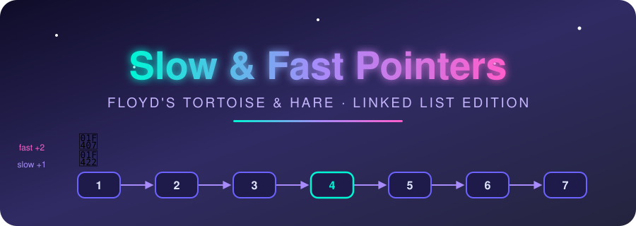
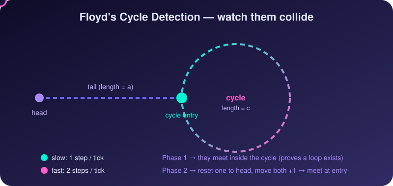

<div align="center">



<br/>


[](https://git.io/typing-svg)

**[📖 Striver A2Z DSA Sheet](https://takeuforward.org/prep-hub/strivers-a2z-dsa-sheet)**

</div>

> [!NOTE]
> Every problem here is solved with the **slow / fast pointer** idea on a linked list: tortoise-hare, middle finder, or the n-gap runner. A "—" means no link is added for that platform (no exact match, or the link is not verified). The small text under each problem name shows which variant it uses. A short **Bonus** section at the end covers problems that hide a linked list inside an array or a number sequence.


## 🐢🐇 How It Works

<div align="center">

</div>

<br/>

If there is a cycle, the fast pointer gains **1 node per tick** on the slow one, so inside the loop the gap shrinks by exactly 1 each step and they must meet. If there is no cycle, `fast` reaches `null` first.

---

## 🧭 The Variants

| Variant | Use it when | Core idea |
| :-- | :-- | :-- |
| **Tortoise–Hare (Detect)** | "Is there a cycle?" | `slow` moves 1, `fast` moves 2; meeting means a cycle |
| **Tortoise–Hare (Entry Point)** | "Where does the cycle start?" / "Remove it" | After they meet, reset one pointer to `head`; move both 1 step at a time; they meet at the entry |
| **Tortoise–Hare (Loop Length)** | "How long is the cycle?" | After the meeting, keep one pointer fixed and walk the other until it returns |
| **Middle Finder** | Palindrome, split, merge sort, delete middle | When `fast` reaches the end, `slow` is at the middle |
| **Gap Method** | Nth from end, rotate, swap kth from ends | Move `fast` n steps ahead first, then move both until `fast` ends |
| **Pointer Switch** | Intersection of two lists | When a pointer hits the end, redirect it to the other list's head; both travel the same total distance |
| **Implicit Cycle** | Array or number sequence that acts like a list | Treat `i → arr[i]` (or `n → next(n)`) as `next` and run Floyd |


<div align="center">

## 🟢 Slow &amp; Fast — Easy

<table>
<thead>
<tr>
<th align="center">#</th>
<th align="left">Problem</th>
<th align="center">Level</th>
<th align="center">GFG</th>
<th align="center">LeetCode</th>
</tr>
</thead>
<tbody>
<tr>
<td align="center">1</td>
<td><b>Middle of the Linked List</b><br/><sub>Middle Finder</sub></td>
<td align="center">🟢&nbsp;Easy</td>
<td align="center"><a href="https://www.geeksforgeeks.org/problems/finding-middle-element-in-a-linked-list/1"></a></td>
<td align="center"><a href="https://leetcode.com/problems/middle-of-the-linked-list/"></a></td>
</tr>
<tr>
<td align="center">2</td>
<td><b>Linked List Cycle</b><br/><sub>Tortoise–Hare (Detect)</sub></td>
<td align="center">🟢&nbsp;Easy</td>
<td align="center"><a href="https://www.geeksforgeeks.org/problems/detect-loop-in-linked-list/1"></a></td>
<td align="center"><a href="https://leetcode.com/problems/linked-list-cycle/"></a></td>
</tr>
<tr>
<td align="center">3</td>
<td><b>Palindrome Linked List</b><br/><sub>Middle Finder + Reverse</sub></td>
<td align="center">🟢&nbsp;Easy</td>
<td align="center"><a href="https://www.geeksforgeeks.org/problems/check-if-linked-list-is-pallindrome/1"></a></td>
<td align="center"><a href="https://leetcode.com/problems/palindrome-linked-list/"></a></td>
</tr>
<tr>
<td align="center">4</td>
<td><b>Intersection of Two Linked Lists</b><br/><sub>Pointer Switch</sub></td>
<td align="center">🟢&nbsp;Easy</td>
<td align="center"><a href="https://www.geeksforgeeks.org/problems/intersection-point-in-y-shapped-linked-lists/1"></a></td>
<td align="center"><a href="https://leetcode.com/problems/intersection-of-two-linked-lists/"></a></td>
</tr>
</tbody>
</table>

---

## 🟡 Slow &amp; Fast — Medium

<table>
<thead>
<tr>
<th align="center">#</th>
<th align="left">Problem</th>
<th align="center">Level</th>
<th align="center">GFG</th>
<th align="center">LeetCode</th>
</tr>
</thead>
<tbody>
<tr>
<td align="center">5</td>
<td><b>Linked List Cycle II</b><br/><sub>Tortoise–Hare (Entry Point)</sub></td>
<td align="center">🟡&nbsp;Medium</td>
<td align="center"><a href="https://www.geeksforgeeks.org/problems/find-the-first-node-of-loop-in-linked-list--170645/1"></a></td>
<td align="center"><a href="https://leetcode.com/problems/linked-list-cycle-ii/"></a></td>
</tr>
<tr>
<td align="center">6</td>
<td><b>Find Length of Loop in Linked List</b><br/><sub>Tortoise–Hare (Loop Length)</sub></td>
<td align="center">🟡&nbsp;Medium</td>
<td align="center"><a href="https://www.geeksforgeeks.org/problems/find-length-of-loop/1"></a></td>
<td align="center">—</td>
</tr>
<tr>
<td align="center">7</td>
<td><b>Remove Loop in Linked List</b><br/><sub>Tortoise–Hare (Entry Point)</sub></td>
<td align="center">🟡&nbsp;Medium</td>
<td align="center"><a href="https://www.geeksforgeeks.org/problems/remove-loop-in-linked-list/1"></a></td>
<td align="center">—</td>
</tr>
<tr>
<td align="center">8</td>
<td><b>Remove Nth Node From End of List</b><br/><sub>Gap Method</sub></td>
<td align="center">🟡&nbsp;Medium</td>
<td align="center"><a href="https://www.geeksforgeeks.org/problems/nth-node-from-end-of-linked-list/1"></a></td>
<td align="center"><a href="https://leetcode.com/problems/remove-nth-node-from-end-of-list/"></a></td>
</tr>
<tr>
<td align="center">9</td>
<td><b>Delete the Middle Node of a Linked List</b><br/><sub>Middle Finder</sub></td>
<td align="center">🟡&nbsp;Medium</td>
<td align="center"><a href="https://www.geeksforgeeks.org/problems/delete-middle-of-linked-list/1"></a></td>
<td align="center"><a href="https://leetcode.com/problems/delete-the-middle-node-of-a-linked-list/"></a></td>
</tr>
<tr>
<td align="center">10</td>
<td><b>Reorder List</b><br/><sub>Middle Finder + Reverse + Merge</sub></td>
<td align="center">🟡&nbsp;Medium</td>
<td align="center">—</td>
<td align="center"><a href="https://leetcode.com/problems/reorder-list/"></a></td>
</tr>
<tr>
<td align="center">11</td>
<td><b>Sort List</b><br/><sub>Middle Finder (Merge Sort)</sub></td>
<td align="center">🟡&nbsp;Medium</td>
<td align="center">—</td>
<td align="center"><a href="https://leetcode.com/problems/sort-list/"></a></td>
</tr>
<tr>
<td align="center">12</td>
<td><b>Rotate List</b><br/><sub>Gap Method</sub></td>
<td align="center">🟡&nbsp;Medium</td>
<td align="center">—</td>
<td align="center"><a href="https://leetcode.com/problems/rotate-list/"></a></td>
</tr>
<tr>
<td align="center">13</td>
<td><b>Swapping Nodes in a Linked List</b><br/><sub>Gap Method</sub></td>
<td align="center">🟡&nbsp;Medium</td>
<td align="center">—</td>
<td align="center"><a href="https://leetcode.com/problems/swapping-nodes-in-a-linked-list/"></a></td>
</tr>
<tr>
<td align="center">14</td>
<td><b>Maximum Twin Sum of a Linked List</b><br/><sub>Middle Finder + Reverse</sub></td>
<td align="center">🟡&nbsp;Medium</td>
<td align="center">—</td>
<td align="center"><a href="https://leetcode.com/problems/maximum-twin-sum-of-a-linked-list/"></a></td>
</tr>
<tr>
<td align="center">15</td>
<td><b>Convert Sorted List to Binary Search Tree</b><br/><sub>Middle Finder (Divide)</sub></td>
<td align="center">🟡&nbsp;Medium</td>
<td align="center">—</td>
<td align="center"><a href="https://leetcode.com/problems/convert-sorted-list-to-binary-search-tree/"></a></td>
</tr>
</tbody>
</table>

---

## 🎁 Bonus — Implicit Linked Lists

*No `ListNode` in sight, but the same cycle trick wins.*

<table>
<thead>
<tr>
<th align="center">#</th>
<th align="left">Problem</th>
<th align="center">Level</th>
<th align="center">GFG</th>
<th align="center">LeetCode</th>
</tr>
</thead>
<tbody>
<tr>
<td align="center">16</td>
<td><b>Happy Number</b><br/><sub>Implicit Cycle (Digit Chain)</sub></td>
<td align="center">🟢&nbsp;Easy</td>
<td align="center">—</td>
<td align="center"><a href="https://leetcode.com/problems/happy-number/"></a></td>
</tr>
<tr>
<td align="center">17</td>
<td><b>Find the Duplicate Number</b><br/><sub>Implicit Cycle (Array as List)</sub></td>
<td align="center">🟡&nbsp;Medium</td>
<td align="center">—</td>
<td align="center"><a href="https://leetcode.com/problems/find-the-duplicate-number/"></a></td>
</tr>
<tr>
<td align="center">18</td>
<td><b>Circular Array Loop</b><br/><sub>Implicit Cycle (Array Jumps)</sub></td>
<td align="center">🟡&nbsp;Medium</td>
<td align="center">—</td>
<td align="center"><a href="https://leetcode.com/problems/circular-array-loop/"></a></td>
</tr>
</tbody>
</table>

</div>

---

## 🧩 Template Cheat Sheet

<details>
<summary><b>🐢🐇 Detect cycle + find entry</b> (click to expand)</summary>

```cpp
ListNode *slow = head, *fast = head;
while (fast && fast->next) {
    slow = slow->next;
    fast = fast->next->next;
    if (slow == fast) {                 // cycle exists
        slow = head;
        while (slow != fast) {          // phase 2
            slow = slow->next;
            fast = fast->next;
        }
        return slow;                    // entry node
    }
}
return nullptr;                         // no cycle
```

</details>

<details>
<summary><b>🎯 Middle of the list</b></summary>

```cpp
ListNode *slow = head, *fast = head;
while (fast && fast->next) {
    slow = slow->next;
    fast = fast->next->next;
}
return slow;   // 2nd middle for even length
// to get the 1st middle: loop while (fast->next && fast->next->next)
```

</details>

<details>
<summary><b>📏 Gap method (Nth from end)</b></summary>

```cpp
ListNode dummy(0, head);
ListNode *slow = &dummy, *fast = &dummy;
for (int i = 0; i < n; i++) fast = fast->next;   // create the gap
while (fast->next) {
    slow = slow->next;
    fast = fast->next;
}
slow->next = slow->next->next;                   // delete target
return dummy.next;
```

</details>

<details>
<summary><b>🔀 Pointer switch (intersection)</b></summary>

```cpp
ListNode *a = headA, *b = headB;
while (a != b) {
    a = a ? a->next : headB;
    b = b ? b->next : headA;
}
return a;   // intersection node or nullptr
```

</details>

<details>
<summary><b>🔢 Implicit cycle (Find the Duplicate Number)</b></summary>

```cpp
int slow = nums[0], fast = nums[0];
do { slow = nums[slow]; fast = nums[nums[fast]]; } while (slow != fast);
slow = nums[0];
while (slow != fast) { slow = nums[slow]; fast = nums[fast]; }
return slow;
```

</details>


## 🧠 Recommended Practice Flow

1. Read the problem only.
2. Write the brute force first (a `HashSet` of visited nodes, or count the length first and walk again).
3. Ask: *can a second pointer at a different speed or offset replace the extra memory or the second pass?*
4. Pick the variant from the table above.
5. Write the optimal solution yourself in VS Code.
6. Dry-run these edge cases: empty list, single node, two nodes, even vs odd length, cycle at head, cycle at tail.
7. Only then check the editorial/video if needed.

### ✅ Quick Revision Checklist

- [ ] Easy: 4 (+ bonus Happy Number)
- [ ] Medium: 11 (+ 2 bonus)
- [ ] Bonus implicit-cycle problems: 3
- [ ] Total: 18

### 🔗 Related Resources

- [Striver A2Z DSA Sheet](https://takeuforward.org/prep-hub/strivers-a2z-dsa-sheet)
- [Take U Forward](https://takeuforward.org/)
- [LeetCode](https://leetcode.com/)
- [GeeksforGeeks](https://www.geeksforgeeks.org/)

> [!IMPORTANT]
> There is no Hard tier here because truly Hard LeetCode problems on this pattern are rare; the hardest ideas (cycle entry proof, palindrome in O(1) space, reorder list) already sit in Medium. Difficulty follows LeetCode, except GFG-only problems, which follow GFG's own rating.

<div align="center">
<br/>

</div>