<div align="center">


<br/>


[.;O(n%C2%B3)+%E2%86%92+O(n).)](https://git.io/typing-svg)

**[📖 Striver A2Z DSA Sheet](https://takeuforward.org/prep-hub/strivers-a2z-dsa-sheet)**

</div>

> [!NOTE]
> Only problems whose solution is Kadane's algorithm or a direct variant of it are included. No plain prefix-sum, sliding-window or monotonic-queue problems. A "—" means no link is added for that platform (no exact match, or the link is not verified). The small text under each problem name shows which Kadane style it uses.


## 🎬 See Kadane's Algorithm In Action

<div align="center">


<br/><br/>


<br/><br/>


<br/><br/>


<br/><br/>


<br/><br/>


</div>

<br/>

### 🧠 Why Does Dropping A Negative Sum Work?

Suppose `cur` is the best sum of a subarray **ending at the previous index**. For the next element `a[i]` there are only two sensible choices:

- **Extend** the old subarray: `cur + a[i]`
- **Restart** at this element: `a[i]`

If `cur < 0`, extending only drags the new sum *down*, so restarting is always at least as good. If `cur ≥ 0`, extending is at least as good. `max(a[i], cur + a[i])` picks the winner without an `if`. Keeping a second variable `best` remembers the highest `cur` ever seen, which is the answer.

> [!TIP]
> **All-negative arrays:** initialise `cur` and `best` with `nums[0]`, not `0`. Starting `best` at `0` would wrongly return `0` for `[-3, -1, -2]`, when the correct answer is `-1`.

---

## 🧭 The Six Kadane Styles

| Style | Use it when | Core idea |
| :-- | :-- | :-- |
| ➕ **Classic** | Largest sum of a contiguous subarray | `cur = max(a, cur + a)`, track `best` |
| ✖️ **Min / Max Tracking** | Products, or you need both the best and the worst | Keep a running max **and** min; a negative swaps them |
| 🔁 **Circular Wrap** | The array is circular, or repeated `k` times | `max(kadane, total − minKadane)` with an all-negative guard |
| 🔺 **Transformed Array** | Profit, gaps, or "swap a range" problems | Run Kadane on differences between neighbours |
| 🧩 **Stateful** | One deletion, alternating sign, a pair of characters | Carry one extra state next to `cur` |
| 🪫 **Reset on Break** | Longest or best run that must keep a rule | Extend while the rule holds, otherwise restart |

### 🗺️ Which Style Do I Need?

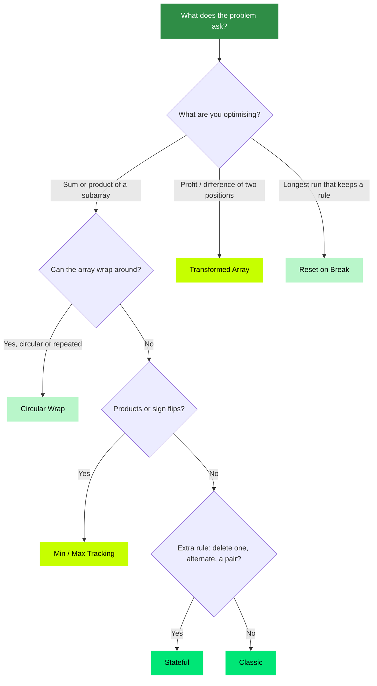

### ⚖️ The Extend / Restart Rule

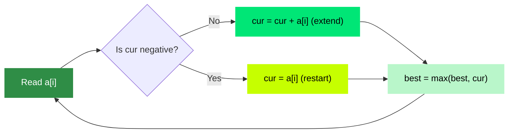

### 🥧 What's In This List

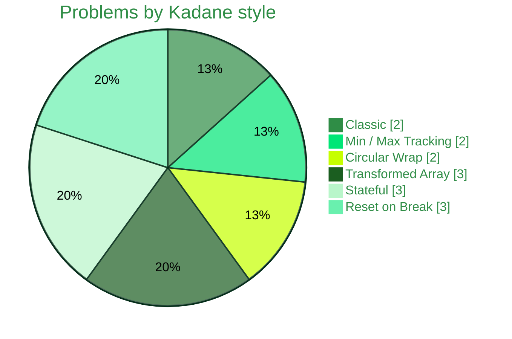


<div align="center">

## 🟢 Kadane — Easy

<table>
<thead>
<tr>
<th align="center">#</th>
<th align="left">Problem</th>
<th align="center">Level</th>
<th align="center">GFG</th>
<th align="center">LeetCode</th>
<th align="center">TUF</th>
</tr>
</thead>
<tbody>
<tr>
<td align="center">1</td>
<td><b>Best Time to Buy and Sell Stock</b><br/><sub>Transformed Array</sub></td>
<td align="center">🟢&nbsp;Easy</td>
<td align="center">—</td>
<td align="center"><a href="https://leetcode.com/problems/best-time-to-buy-and-sell-stock/"></a></td>
<td align="center">—</td>
</tr>
<tr>
<td align="center">2</td>
<td><b>Maximum Difference Between Increasing Elements</b><br/><sub>Transformed Array</sub></td>
<td align="center">🟢&nbsp;Easy</td>
<td align="center">—</td>
<td align="center"><a href="https://leetcode.com/problems/maximum-difference-between-increasing-elements/"></a></td>
<td align="center">—</td>
</tr>
<tr>
<td align="center">3</td>
<td><b>Maximum Ascending Subarray Sum</b><br/><sub>Reset on Break</sub></td>
<td align="center">🟢&nbsp;Easy</td>
<td align="center">—</td>
<td align="center"><a href="https://leetcode.com/problems/maximum-ascending-subarray-sum/"></a></td>
<td align="center">—</td>
</tr>
<tr>
<td align="center">4</td>
<td><b>Longest Continuous Increasing Subsequence</b><br/><sub>Reset on Break</sub></td>
<td align="center">🟢&nbsp;Easy</td>
<td align="center">—</td>
<td align="center"><a href="https://leetcode.com/problems/longest-continuous-increasing-subsequence/"></a></td>
<td align="center">—</td>
</tr>
</tbody>
</table>

---

## 🟡 Kadane — Medium

<table>
<thead>
<tr>
<th align="center">#</th>
<th align="left">Problem</th>
<th align="center">Level</th>
<th align="center">GFG</th>
<th align="center">LeetCode</th>
<th align="center">TUF</th>
</tr>
</thead>
<tbody>
<tr>
<td align="center">5</td>
<td><b>Maximum Subarray</b><br/><sub>Classic</sub></td>
<td align="center">🟡&nbsp;Medium</td>
<td align="center"><a href="https://www.geeksforgeeks.org/problems/kadanes-algorithm-1587115620/1"></a></td>
<td align="center"><a href="https://leetcode.com/problems/maximum-subarray/"></a></td>
<td align="center">—</td>
</tr>
<tr>
<td align="center">6</td>
<td><b>Maximum Sum Circular Subarray</b><br/><sub>Circular Wrap</sub></td>
<td align="center">🟡&nbsp;Medium</td>
<td align="center">—</td>
<td align="center"><a href="https://leetcode.com/problems/maximum-sum-circular-subarray/"></a></td>
<td align="center">—</td>
</tr>
<tr>
<td align="center">7</td>
<td><b>Maximum Product Subarray</b><br/><sub>Min / Max Tracking</sub></td>
<td align="center">🟡&nbsp;Medium</td>
<td align="center">—</td>
<td align="center"><a href="https://leetcode.com/problems/maximum-product-subarray/"></a></td>
<td align="center">—</td>
</tr>
<tr>
<td align="center">8</td>
<td><b>Maximum Absolute Sum of Any Subarray</b><br/><sub>Min / Max Tracking</sub></td>
<td align="center">🟡&nbsp;Medium</td>
<td align="center">—</td>
<td align="center"><a href="https://leetcode.com/problems/maximum-absolute-sum-of-any-subarray/"></a></td>
<td align="center">—</td>
</tr>
<tr>
<td align="center">9</td>
<td><b>Maximum Subarray Sum with One Deletion</b><br/><sub>Stateful</sub></td>
<td align="center">🟡&nbsp;Medium</td>
<td align="center">—</td>
<td align="center"><a href="https://leetcode.com/problems/maximum-subarray-sum-with-one-deletion/"></a></td>
<td align="center">—</td>
</tr>
<tr>
<td align="center">10</td>
<td><b>Maximum Alternating Subarray Sum</b><br/><sub>Stateful</sub></td>
<td align="center">🟡&nbsp;Medium</td>
<td align="center">—</td>
<td align="center"><a href="https://leetcode.com/problems/maximum-alternating-subarray-sum/"></a></td>
<td align="center">—</td>
</tr>
<tr>
<td align="center">11</td>
<td><b>Longest Turbulent Subarray</b><br/><sub>Reset on Break</sub></td>
<td align="center">🟡&nbsp;Medium</td>
<td align="center">—</td>
<td align="center"><a href="https://leetcode.com/problems/longest-turbulent-subarray/"></a></td>
<td align="center">—</td>
</tr>
<tr>
<td align="center">12</td>
<td><b>K-Concatenation Maximum Sum</b><br/><sub>Circular Wrap</sub></td>
<td align="center">🟡&nbsp;Medium</td>
<td align="center">—</td>
<td align="center"><a href="https://leetcode.com/problems/k-concatenation-maximum-sum/"></a></td>
<td align="center">—</td>
</tr>
</tbody>
</table>

---

## 🔴 Kadane — Hard

<table>
<thead>
<tr>
<th align="center">#</th>
<th align="left">Problem</th>
<th align="center">Level</th>
<th align="center">GFG</th>
<th align="center">LeetCode</th>
<th align="center">TUF</th>
</tr>
</thead>
<tbody>
<tr>
<td align="center">13</td>
<td><b>Max Sum of Rectangle No Larger Than K</b><br/><sub>Classic (2D)</sub></td>
<td align="center">🔴&nbsp;Hard</td>
<td align="center">—</td>
<td align="center"><a href="https://leetcode.com/problems/max-sum-of-rectangle-no-larger-than-k/"></a></td>
<td align="center">—</td>
</tr>
<tr>
<td align="center">14</td>
<td><b>Maximum Score of Spliced Array</b><br/><sub>Transformed Array</sub></td>
<td align="center">🔴&nbsp;Hard</td>
<td align="center">—</td>
<td align="center"><a href="https://leetcode.com/problems/maximum-score-of-spliced-array/"></a></td>
<td align="center">—</td>
</tr>
<tr>
<td align="center">15</td>
<td><b>Substring With Largest Variance</b><br/><sub>Stateful</sub></td>
<td align="center">🔴&nbsp;Hard</td>
<td align="center">—</td>
<td align="center"><a href="https://leetcode.com/problems/substring-with-largest-variance/"></a></td>
<td align="center">—</td>
</tr>
</tbody>
</table>

</div>

---

## 🔥 Templates

<details open>
<summary><b>➕ Classic</b></summary>

```java
int cur = nums[0], best = nums[0];

for (int i = 1; i < n; i++) {
    cur  = Math.max(nums[i], cur + nums[i]);   // extend or restart
    best = Math.max(best, cur);                // remember the best
}
```

Need the subarray itself? Track where the current run started:

```java
int cur = 0, best = Integer.MIN_VALUE;
int start = 0, bestL = 0, bestR = 0;

for (int i = 0; i < n; i++) {
    if (cur < 0) { cur = 0; start = i; }       // drop negative baggage
    cur += nums[i];
    if (cur > best) { best = cur; bestL = start; bestR = i; }
}
// best = max sum, nums[bestL .. bestR] = the subarray
```

</details>

<details>
<summary><b>✖️ Min / Max Tracking (Maximum Product Subarray)</b></summary>

```java
int mx = nums[0], mn = nums[0], best = nums[0];

for (int i = 1; i < n; i++) {
    int a  = nums[i];
    int hi = Math.max(a, Math.max(mx * a, mn * a));
    int lo = Math.min(a, Math.min(mx * a, mn * a));
    mx = hi;  mn = lo;                          // a negative can swap them
    best = Math.max(best, mx);
}
```

</details>

<details>
<summary><b>🔁 Circular Wrap</b></summary>

```java
int total = 0;
int curMax = 0, bestMax = nums[0];
int curMin = 0, bestMin = nums[0];

for (int a : nums) {
    total  += a;
    curMax  = Math.max(a, curMax + a);  bestMax = Math.max(bestMax, curMax);
    curMin  = Math.min(a, curMin + a);  bestMin = Math.min(bestMin, curMin);
}
// if every element is negative, wrapping would pick an empty subarray
return bestMax > 0 ? Math.max(bestMax, total - bestMin) : bestMax;
```

</details>

<details>
<summary><b>🔺 Transformed Array (stock profit as Kadane on differences)</b></summary>

```java
int cur = 0, best = 0;

for (int i = 1; i < n; i++) {
    cur  = Math.max(0, cur + prices[i] - prices[i - 1]);   // difference as the "element"
    best = Math.max(best, cur);
}
```

</details>

<details>
<summary><b>🧩 Stateful (Maximum Subarray Sum with One Deletion)</b></summary>

```java
int keep = arr[0];     // best sum ending here, nothing deleted
int del  = 0;          // best sum ending here, one element already deleted
int best = arr[0];

for (int i = 1; i < n; i++) {
    del  = Math.max(keep, del + arr[i]);       // delete arr[i], or deleted earlier
    keep = Math.max(arr[i], keep + arr[i]);
    best = Math.max(best, Math.max(keep, del));
}
```

</details>

<details>
<summary><b>🪫 Reset on Break (Maximum Ascending Subarray Sum)</b></summary>

```java
int cur = nums[0], best = nums[0];

for (int i = 1; i < n; i++) {
    cur  = (nums[i] > nums[i - 1]) ? cur + nums[i] : nums[i];   // rule holds: extend, else restart
    best = Math.max(best, cur);
}
```

</details>

<details>
<summary><b>🧱 2D Kadane (Max Sum Rectangle)</b></summary>

```java
for (int top = 0; top < rows; top++) {
    int[] colSum = new int[cols];
    for (int bottom = top; bottom < rows; bottom++) {
        for (int c = 0; c < cols; c++) colSum[c] += mat[bottom][c];
        // run 1D Kadane on colSum  ->  best rectangle between rows top..bottom
        // (for "no larger than K" use prefix sums + TreeSet instead of plain Kadane)
    }
}
```

</details>

---

## 🧩 Quick Pattern Recognition

| Question wording | Think |
| :-- | :-- |
| **Largest sum of a contiguous subarray** | Classic |
| **Largest product of a contiguous subarray** | Min / Max Tracking |
| **Array is circular / repeated k times** | Circular Wrap |
| **Best buy-sell profit, or best range to flip or swap** | Transformed Array |
| **Delete one element / alternating signs / a pair of characters** | Stateful |
| **Longest or best run that must keep increasing, alternating, ...** | Reset on Break |
| **Rows and columns, largest sum rectangle** | 2D Kadane |

## 🧠 Memory Trick

<div align="center">

| ➕ **EXTEND** | 🔄 **RESTART** | 📈 **TRACK** | 🔁 **WRAP** |
| :--: | :--: | :--: | :--: |
| carry if it helps | drop if it hurts | keep the best seen | total − worst |

</div>


## 🧠 Recommended Practice Flow

1. Read the problem only.
2. Write the brute force first (usually three nested loops, `O(n³)`, or `O(n²)` with a running sum).
3. Ask: *at each index, can I decide extend vs restart from one number?*
4. Pick the style from the table above.
5. Write the optimal solution yourself in VS Code.
6. Dry-run one normal example and these edge cases: all negative, single element, all positive, zeros.
7. Only then check the editorial/video if needed.

### ✅ Quick Revision Checklist

- [ ] Kadane Easy — 4
- [ ] Kadane Medium — 8
- [ ] Kadane Hard — 3
- [ ] Total — 15

### 🔗 Related Resources

- [Striver A2Z DSA Sheet](https://takeuforward.org/prep-hub/strivers-a2z-dsa-sheet)
- [Take U Forward](https://takeuforward.org/)
- [LeetCode](https://leetcode.com/)
- [GeeksforGeeks — Kadane's Algorithm](https://www.geeksforgeeks.org/problems/kadanes-algorithm-1587115620/1)

> [!IMPORTANT]
> Difficulty follows LeetCode. The Hard list is shorter because only a few hard problems are solved by Kadane's algorithm alone; most hard subarray problems need extra structures such as heaps, deques or segment trees.

<div align="center">

</div>