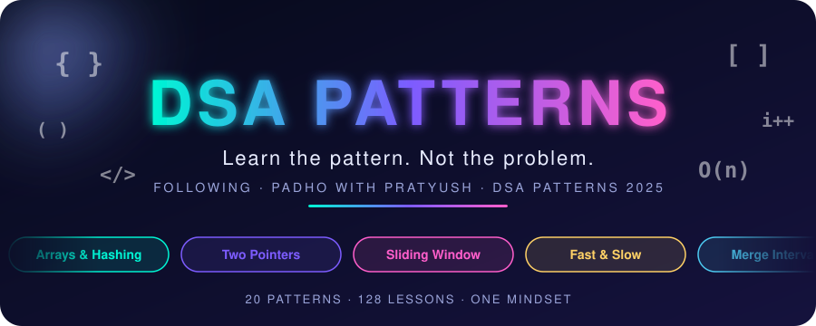
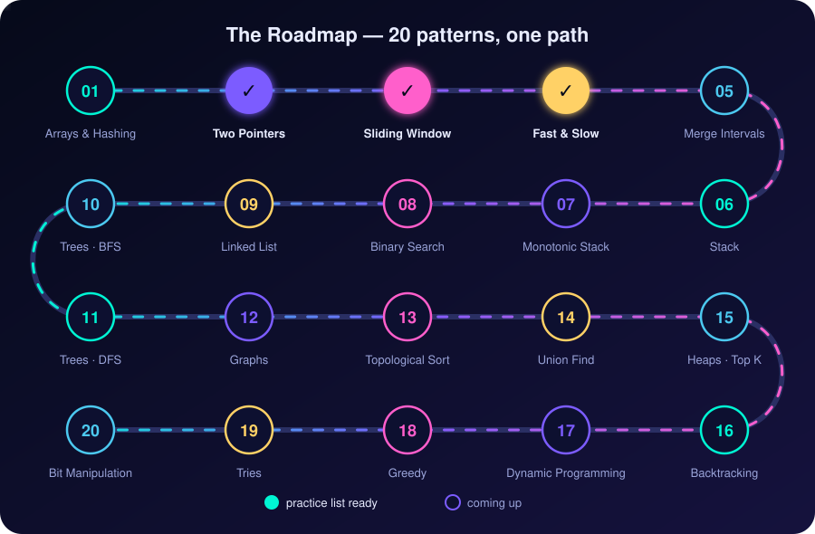
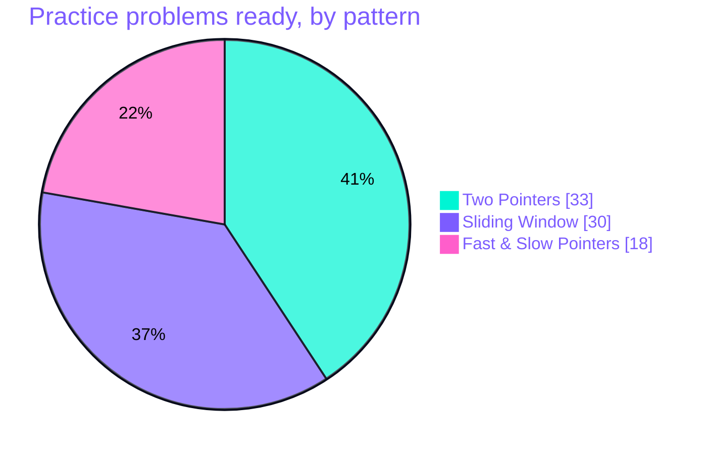
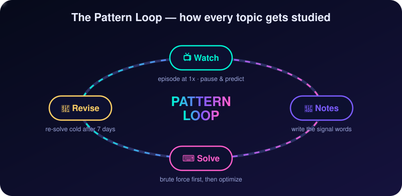
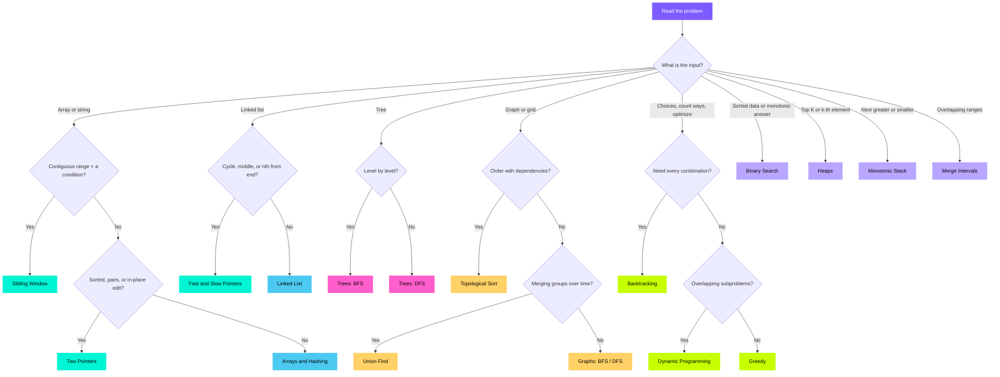

<div align="center">



<br/>


[](https://git.io/typing-svg)

**[📺 Playlist](https://www.youtube.com/playlist?list=PLbJhGqY-mq47k_WLUtzVjmarUm1EuXPj2)  ·  [📊 Pattern Sheet](https://docs.google.com/spreadsheets/d/1T5-nGsJ9WNwna44e9WWRD0jlZIT5KxVOGvylcvvVrY8/edit?usp=sharing)  ·  [🗂 Roadmap](#-the-roadmap)  ·  [🧭 Which Pattern?](#️-which-pattern-do-i-need)  ·  [📁 Structure](#-repo-structure)**

</div>

> [!NOTE]
> This repo is my pattern-first DSA journey following **DSA Patterns 2025** by [Padho with Pratyush](https://www.youtube.com/@padho_with_pratyush). Every folder is one pattern with a practice list (GFG, LeetCode, TUF links), templates, and my solutions. Organized by **pattern, not by episode**, so revision is fast.


## 🗺 The Roadmap

<div align="center">

</div>

<br/>

### 🗂 Table of Contents

| # | Pattern | Spot it when… | Problems | Status |
| :-: | :-- | :-- | :-: | :-: |
| `01` | **Arrays & Hashing** | Counting, duplicates, lookups, grouping, prefix sums | — | ⏳ Soon |
| `02` | **[Two Pointers](./02-Two-Pointers/)** | Sorted array, pairs/triplets, palindromes, in-place edits | 33 | ✅ Ready |
| `03` | **[Sliding Window](./03-Sliding-Window/)** | Longest / shortest **contiguous** range under a condition | 30 | ✅ Ready |
| `04` | **[Fast & Slow Pointers](./04-Fast-and-Slow-Pointers/)** | Cycle, middle node, nth from end | 18 | ✅ Ready |
| `05` | **Merge Intervals** | Overlapping ranges, meeting rooms, schedules | — | ⏳ Soon |
| `06` | **Stack** | Matching brackets, undo, nested structure | — | ⏳ Soon |
| `07` | **Monotonic Stack** | Next greater / smaller element, histograms | — | ⏳ Soon |
| `08` | **Binary Search** | Sorted data, or a monotonic answer space (minimize the max) | — | ⏳ Soon |
| `09` | **Linked List** | Reverse, merge, reorder, pointer surgery | — | ⏳ Soon |
| `10` | **Trees — BFS** | Level order, right view, minimum depth | — | ⏳ Soon |
| `11` | **Trees — DFS** | Path sums, depth, subtree questions, recursion | — | ⏳ Soon |
| `12` | **Graphs** | Connectivity, shortest paths, grids and islands | — | ⏳ Soon |
| `13` | **Topological Sort** | Dependencies, course schedule, build order | — | ⏳ Soon |
| `14` | **Union Find** | Dynamic connectivity, grouping, cycle in undirected graph | — | ⏳ Soon |
| `15` | **Heaps / Top K** | Top K, k-th largest, merge K lists, running median | — | ⏳ Soon |
| `16` | **Backtracking** | Generate all subsets, permutations, combinations | — | ⏳ Soon |
| `17` | **Dynamic Programming** | Overlapping subproblems; count or optimize over choices | — | ⏳ Soon |
| `18` | **Greedy Algorithms** | A local best choice is provably global; scheduling | — | ⏳ Soon |
| `19` | **Tries** | Prefix search, autocomplete, word dictionary | — | ⏳ Soon |
| `20` | **Bit Manipulation** | XOR tricks, masks, powers of two | — | ⏳ Soon |

> [!TIP]
> Click a ✅ pattern to open its practice list. The other folders get unlocked as I work through the playlist.


## 📈 Progress

<div align="center">

</div>




## 🔁 How I Study Each Pattern

<div align="center">

</div>

1. **Watch** the episode once, pausing before each solution to predict the approach.
2. **Notes**: write the pattern's *signal words* (what in the problem statement gives it away).
3. **Solve** the practice list: brute force first, then ask *"what work am I repeating?"*
4. **Revise**: re-solve a few cold after a week. If I can't, the pattern isn't mine yet.

## 🧭 Which Pattern Do I Need?




## 📁 Repo Structure

```text
DSA-Pattern/
│
├── 📂 Images/                      ← platform icons used in the practice lists
│   ├── gfg.png
│   ├── leetcode.png
│   └── takeUforward.jpg
│
├── 📂 assets/                      ← animated SVGs for this README
│
├── 📂 01-Arrays-and-Hashing/
├── 📂 02-Two-Pointers/             ← README.md + assets/ + solutions/
├── 📂 03-Sliding-Window/
├── 📂 04-Fast-and-Slow-Pointers/
│   ⋮
├── 📂 20-Bit-Manipulation/
│
└── 📄 README.md                    ← you are here
```

Each pattern folder holds:

| File | What's inside |
| :-- | :-- |
| `README.md` | The practice list with GFG / LeetCode / TUF links, templates, animations |
| `solutions/` | One file per problem, commented and tagged with its pattern |
| `notes.md` *(optional)* | My own signal words, mistakes, and edge cases |

### 💡 Solution File Header

```java
// Problem  : Two Sum II - Input Array Is Sorted
// Link     : https://leetcode.com/problems/two-sum-ii-input-array-is-sorted/
// Pattern  : Two Pointers (Opposite Ends)
// Time     : O(n)
// Space    : O(1)
```

## 🚀 Getting Started

```bash
git clone https://github.com/<your-username>/DSA-Pattern.git
cd DSA-Pattern
```

1. Pick a ✅ pattern from the table above.
2. Read its `README.md`: animations first, then templates.
3. Attempt each problem yourself before opening a platform link.
4. Compare with the code in `solutions/`.

## 🔗 Resources

| Resource | Link |
| :-- | :-- |
| 📺 DSA Patterns 2025 playlist (128 videos) | [YouTube](https://www.youtube.com/playlist?list=PLbJhGqY-mq47k_WLUtzVjmarUm1EuXPj2) |
| 📊 Pratyush's pattern sheet | [Google Sheet](https://docs.google.com/spreadsheets/d/1T5-nGsJ9WNwna44e9WWRD0jlZIT5KxVOGvylcvvVrY8/edit?usp=sharing) |
| 🎓 Striver A2Z DSA Sheet | [takeUforward](https://takeuforward.org/prep-hub/strivers-a2z-dsa-sheet) |
| 🧪 LeetCode | [leetcode.com](https://leetcode.com/) |
| 🟩 GeeksforGeeks | [geeksforgeeks.org](https://www.geeksforgeeks.org/) |

> [!IMPORTANT]
> **A pattern is a way of seeing, not a list of solutions.** If you can explain *why* the pointers move the way they do, you can solve a problem you have never seen before.

<div align="center">

**If this repo helps you, drop a ⭐ and keep the streak going.**

<sub>Following the course by Padho with Pratyush · Not affiliated · For educational use only</sub>


</div>